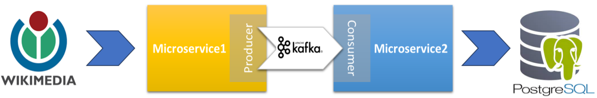

## Spring Boot Application with Apache Kafka and PostgreSQL

### Overview

This project is a Spring Boot application that demonstrates the implementation of a microservices architecture using 
Apache Kafka as the messaging system. The application monitors wikimedia in real-time and stores changes into database, 
which can then be utilised for analytical purposes. The application consists of two microservices, one is responsible 
for monitoring the changes, the other is responsible for processing the data, storing it to the database and exposing 
apis to access the stored data. Both microservices communicate with each other through Kafka Broker. 

### Technologies Used

- **Spring Boot:** The framework for building the microservices.
- **Apache Kafka:** Messaging system for communication between microservices.
- **PostgreSQL:** Database for storing application data.

### License

This project is licensed under the [MIT License](LICENSE).
